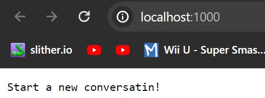
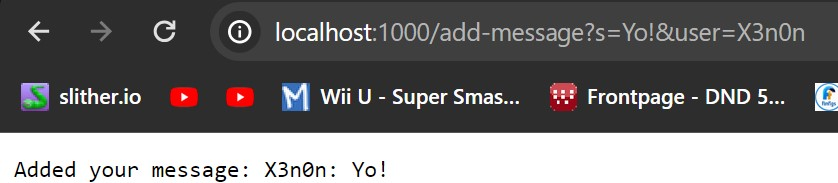
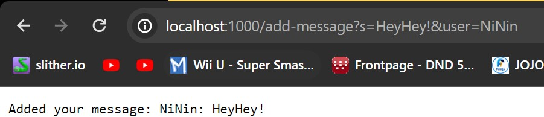
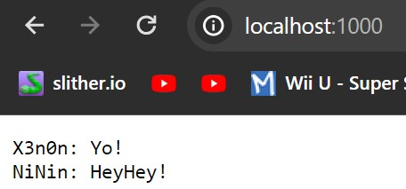
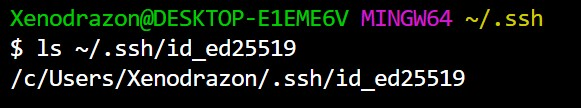
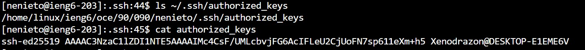
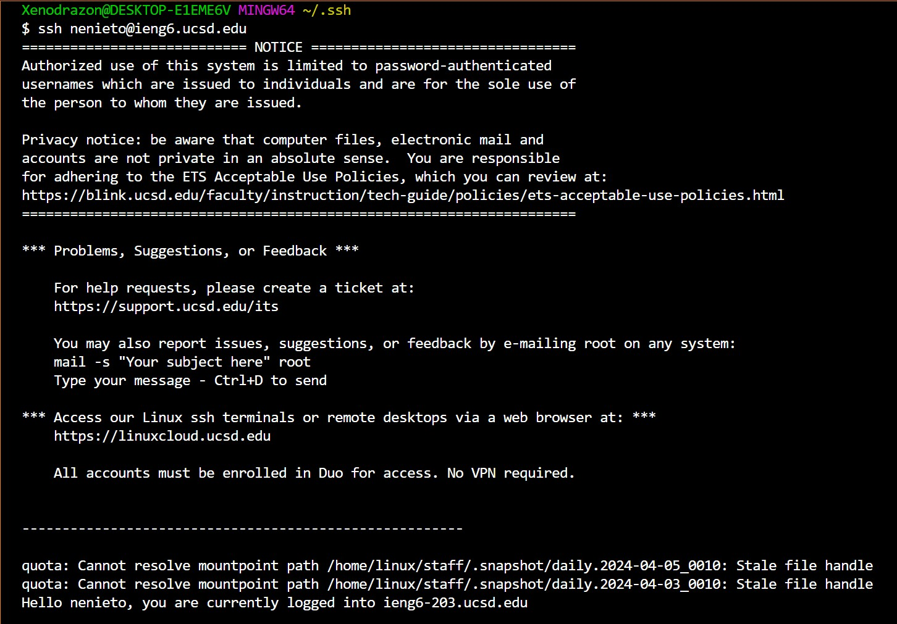

## Lab2 Report : A local ChatServer!
***
As we get more familiar with coding in java and the tools made available to us via java's built in helper methods, we have now been able to learn to start and intereact with a local server!
We've done so in a manner that by through edditing our `URL`, we can add new messages to the server and iew them at the `root` of the server! Lets take a look at the **entirety** of our code and we'll pick out bits to analyze in a moment:
```
import java.io.IOException;
import java.net.URI;
import java.util.ArrayList;

class chatInitializer{
    static String format(ArrayList<String> arr){
        
        String outString = "";
        
        for(int i = 0; i < arr.size(); i++){
            outString += arr.get(i) + "\n";
        }

        return outString;

    }
}

class Handler implements URLHandler {
    ArrayList<String> ChatLogArr = new ArrayList<>();
    String superChat = "";

    public String handleRequest(URI url) {
        if (url.getPath().equals("/")) {

            superChat = chatInitializer.format(ChatLogArr);
            if(superChat.equals("")){return "Start a new conversatin!";} 
            return superChat; //I forgot to correct the spelling, ^ sue me
            
        } 
        else if (url.getPath().equals("/add-message")) {
            
            String[] Input = url.getQuery().split("&");
            
            
            if(Input.length == 2){
                String[] message = Input[0].split("=");
                String[] user = Input[1].split("=");
                
                boolean verUser = user.length == 2 && user[0].equals("user");
                boolean verMess = message.length == 2 && message[0].equals("s");

                
                if(verUser && verMess){
                    String usermsg = user[1] + ": " + message[1];
                    ChatLogArr.add(usermsg);
                    return "Added your message: " + usermsg;
                }                
            }
            return "eerrmm something went wrong with the message extension!";

                
        }
        else{return "404 Not Found!";}
    }
            
} 

    


public class ChatServer {
    public static void main(String[] args) throws IOException {
        if(args.length == 0){
            System.out.println("Missing port number! Try any number between 1024 to 49151");
            return;
        }

        int port = Integer.parseInt(args[0]);

        Server.start(port, new Handler());
    }
}
```

That looks like a lot! However, everything in the `ChatServer` class is actually just passing instructions to teh provided `Server` class to start up the local host and let us interact with it! The real meat and potatoes is in the `Handler` class.

Now, before we pick it apart, lets look at some pictures illustrating the server in use! After compiling the server and starting a local host, we get the following initial view:


After this, we'll edit our search bar twice with as shown in the following 2 pictures!




Lets break down whats going on here by looking at our code and the given extensions!
Both pictures are essentially calling the same methods, just with slight differences in what is passed to the method!
As shown by the `/add-message` declaration in the search bar right after the end of our `local server` adress, we dont want the default page!
Luckily, we can see that the **30th** line of code in our file checks for this same extension! Right after, we tell java to chop up the rest of the input after this to bits, specifically bits seperated by `&`!

Afterwards, we make sure to check the size of our cut up input, since we *expect* there to only be two calls, one for a **message** and the other for the **username**, any other size returns our little error text!

Ok, so we're definitely working with 2 Strings, now what? What if i passed `/add-message?IsThisHowYouDoIT&Im not too sure`
into the `URL`? thats the reason for our next check!
We cut up our bits into smaller bits at every occurance of `=` and save them in their respective feilds! Then, we craft a pair of local `booleans` just so the code is easier to read. The two booleans act as verifications for the **message** and **username** parts of our argument! After we're double positive that our argument is in the correct format, the code starts to make some changes to our server!

Reading from the `message` and `user` arrays, the code saves the 2nd value in each to seperate feilds, initializing a `usermsg` `String` value for us, we then take that `usermsg` and save it to our `ChatLogArr` `ArrayList` to be used the next time we call our main page all while returning something to end the loop and give the user some verification that the code is working properly.

The 2nd screenshot is essentially doing the same thing all over again but with a different `message` and `user` array!

Now that our `ChatLogArr` *isn't* empty, the next time we visit the main page, the code returns the contents of `superChat`, a value created in our `chatInitializer` helper class, which goes through the contents of our `ChatLogArr` and formats them such that when one long `String` made of its contents is returned, they display one after the other on a new line:



 And with that we see our code working properly and know *how* it works, nex lets get those other screenshots out of the way:



Here we see the `list` leading to the location of our *private* key, you can tell because theres no `.pub` at the end!



Now, we see the pair to our *private* key, the *public* key! Stored on the `ieng6` server to allow us to connet from the specified device without needing a password.



And Just for a little proof, we see the laptop who provided the *public* key gain access to teh `ieng6` server with no issue since the *public* and *private* keys match!


As for a reflection on the last two weeks of labs, I found the ease of use of creating servers and sites to be very interesting! The local server acts as the first and easiest step to a website, while sshing into a communal server and uploading it there acts as the next step up since everyone under the same network can access it, and then the final step I would assume is makeing a private server that can handle outside visitors and traffic! Thats the next step in website creation that I'm very interested in, like how would I make a local host safely accessible? What if i wanted a custom domain?
