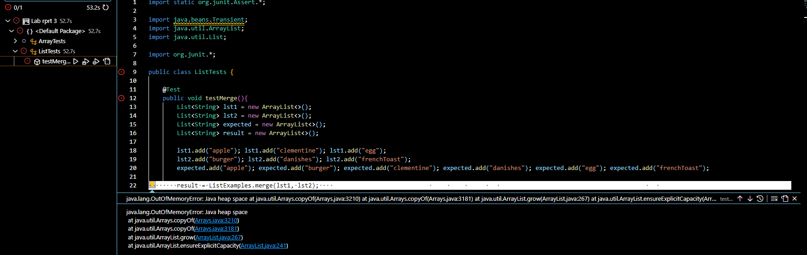
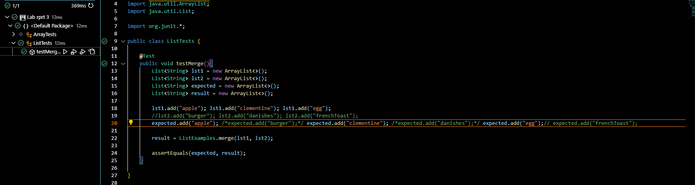

## Lab3 Report : Squashing some bugs!
***
Getting more familiar with Java's helper methods is fine and all, but what use are those methods if Java is not told what to do in the correct manner! Remember, computers need specific and definite instructions to do thier job. In that case, what happens when our silly human brains muck it up and make a mistake in out code? Well, we are left with a **bug**!

In our lab section last week, we made use of `Junit` and its methods to go over some given methods and write tests, some of these methods however did not always work when they were tested! This unexpected output is called a `symptom` while the actual error in the code itself is the bug we need to find and squash!

Looking back at the given code, lets look at the `merge` method in our `ListExamples.java` file, here we'll spot a simple bug, but a code-breaking bug nonetheless.
```
 static List<String> merge(List<String> list1, List<String> list2) {
    List<String> result = new ArrayList<>();
    int index1 = 0, index2 = 0;
    while(index1 < list1.size() && index2 < list2.size()) {
      if(list1.get(index1).compareTo(list2.get(index2)) < 0) {
        result.add(list1.get(index1));
        index1 += 1;
      }
      else {
        result.add(list2.get(index2));
        index2 += 1;
      }
    }
    while(index1 < list1.size()) {
      result.add(list1.get(index1));
      index1 += 1;
    }
    while(index2 < list2.size()) {
      result.add(list2.get(index2));
      index1 += 1;
    }
    return result;
  }
```

Can you see the bug in  the given code? If not thats alright, first lets look at the test that brought the issue to light!

```
public class ListTests {
    
    @Test
    public void testMerge(){
        List<String> lst1 = new ArrayList<>();
        List<String> lst2 = new ArrayList<>();
        List<String> expected = new ArrayList<>();
        List<String> result = new ArrayList<>();

        lst1.add("apple"); lst1.add("clementine"); lst1.add("egg");
        lst2.add("burger"); lst2.add("danishes"); lst2.add("frenchToast");
        expected.add("apple"); expected.add("burger"); expected.add("clementine"); expected.add("danishes"); expected.add("egg"); expected.add("frenchToast");

        result = ListExamples.merge(lst1, lst2);

        assertEquals(expected, result);
    }

}
```

Now, the `merge` function is meant to take two `String` type `ArrayList`s and then combine them into an alphebetically ordered `ArrayList` containing *all* the words in the two inputs, runnign everything as-is, however, we get the following:



Huh, an out of memory error? How could that be! Our `Lists` are incredibly small when compared to the total storage available to Java! Well, this `symptom` is due to the `bug` that we know is present in the method's code.
Looking closer, we see that in the following section:
```
}
    while(index2 < list2.size()) {
      result.add(list2.get(index2));
      index1 += 1;
    }
```
We are incrementing the wrong index pointer when we are meant to go through the 2nd `List`! This causes our program to run indefinately as it tries to increment through the 2nd list with its while loop, eventuially using up all the `memory` available on the `stack`.

Luckily, we had a well written test to pick out this `bug` however, not *all* tests would trap this `bug`! Lets try adding some list 1 with an wmpty list 2:

```
public class ListTests {
    
    @Test
    public void testMerge(){
        List<String> lst1 = new ArrayList<>();
        List<String> lst2 = new ArrayList<>();
        List<String> expected = new ArrayList<>();
        List<String> result = new ArrayList<>();

        lst1.add("apple"); lst1.add("clementine"); lst1.add("egg");
        //lst2.add("burger"); lst2.add("danishes"); lst2.add("frenchToast");
        expected.add("apple");expected.add("clementine");  expected.add("egg");

        result = ListExamples.merge(lst1, lst2);

        assertEquals(expected, result);
    }

}
```
Running the given test results in the following:


Now our test passes just fine even if the bug isnt fixed at all! This is because with an empty `list2`, we never run into the broken while loop sincec its index already equals its length; zero.
With those two examples, fixing the actual bug is quite easy, from the initial code that was first displayed, we make one simple change:
```
}
    while(index2 < list2.size()) {
      result.add(list2.get(index2));
      index2 += 1;
    }
```
Index2! Now that index2 is being incrememnted as it should be, the while loop will end as intended with there are some iterations of list 2 to `merge`, and after the edit, our orginally failing test does run and give results as expected!


# **Now, onto part 2.**
Over the last few weeks we have been exposed to even more interesting commands, one of the more interesting in my opinion, being `grep`! Standing for `"Global Regular Expression"`, the main purpose of `grep` is to take some input and search through said file for some other parameter that its passed!

Before we get into the more interesting uses of grep, lets start with a basic case, in the `./docsearch/technical/plos` directory, calling
```
grep Kofi journal.pbio.0020001.txt
```
Will return:
```
Kofi Annan, the Secretary-General of the United Nations, recently called attention to
```
This is the only line in the `journal.pbio.0020001.txt` file that6 contained the string Kofi, so it was the only line printed in our terminal!

Now, onto the first extended use of grep, courtesey of [StudyStream+](https://www.youtube.com/watch?v=zK5pGrPd_Zc&t=85s) !
Taking advantage of `pipelining` we can instead pass an entire directory to `grep` should we choose to do so:

```
PC@DESKTOP-VM7AB4C MINGW64 ~/Downloads/CSE/CSE 15L/Lab rprt 3/docsearch/technical/plos (main)
$ ls | grep  002011
journal.pbio.0020112.txt
journal.pbio.0020113.txt
journal.pbio.0020116.txt
pmed.0020113.txt
pmed.0020114.txt
pmed.0020115.txt
pmed.0020116.txt
pmed.0020117.txt
pmed.0020118.txt
```
Doing this lets us search an entire directory for a specific keyword! Above we see files starting with the numbers "002011".
But, we could also use it to do something like:
```
Xenodrazon@DESKTOP-E1EME6V MINGW64 ~/technical/government/Post_Rate_Comm (main)
$ ls | grep Cohenetal | grep .txt
Cohenetal_comparison.txt
Cohenetal_Cost_Function.txt
Cohenetal_CreamSkimming.txt
Cohenetal_DeliveryCost.txt
Cohenetal_RuralDelivery.txt
Cohenetal_Scale.txt
```
By taking advantage of `pipelining`, we could run multiple `grep` commands to find all the files in a directory of a specific type containing a specific keyword in its name!


Running `grep` over the entirety of a directory is neat, but what about accessing the files *in* that directory?
Well `grep` allows us to do just that aswell through adding a recursive flag!
```
Xenodrazon@DESKTOP-E1EME6V MINGW64 ~/technical/government/Post_Rate_Comm (main)
$ ls | grep -r "make up"
Cohenetal_CreamSkimming.txt:in any 5-Digit ZIP Code nor is it likely that they make up the
Cohenetal_DeliveryCost.txt:the Rural National Mail Count System.21 City carriers make up 72
Cohenetal_DeliveryCost.txt:percent of the routes and rural carriers make up the
Gleiman_EMASpeech.txt:Congress appropriated tax dollars to make up the difference. The
Mitchell_6-17-Mit.txt:below breakeven and will have to make up the losses with a price
```
The `-r` flag used right after `grep` tells the function to inspect each file it is passed closely, instead of just looking at the filename, `grep` accesses each file inside it and returns the filename alongwith the line that contains the keyword or words we asked it to search for!

Here is one more example of running `grep` like that!
