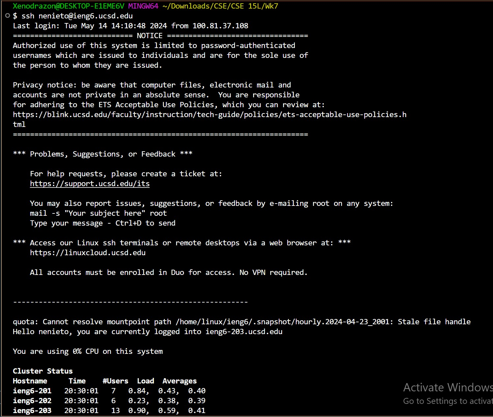
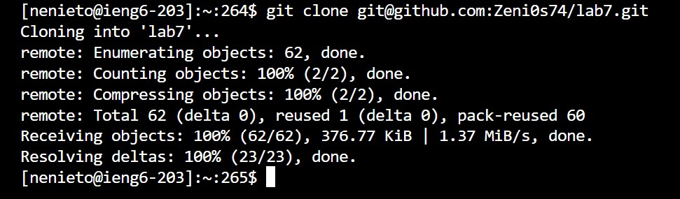
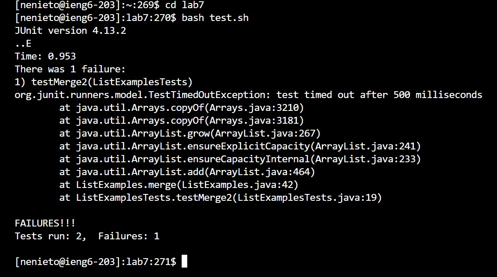
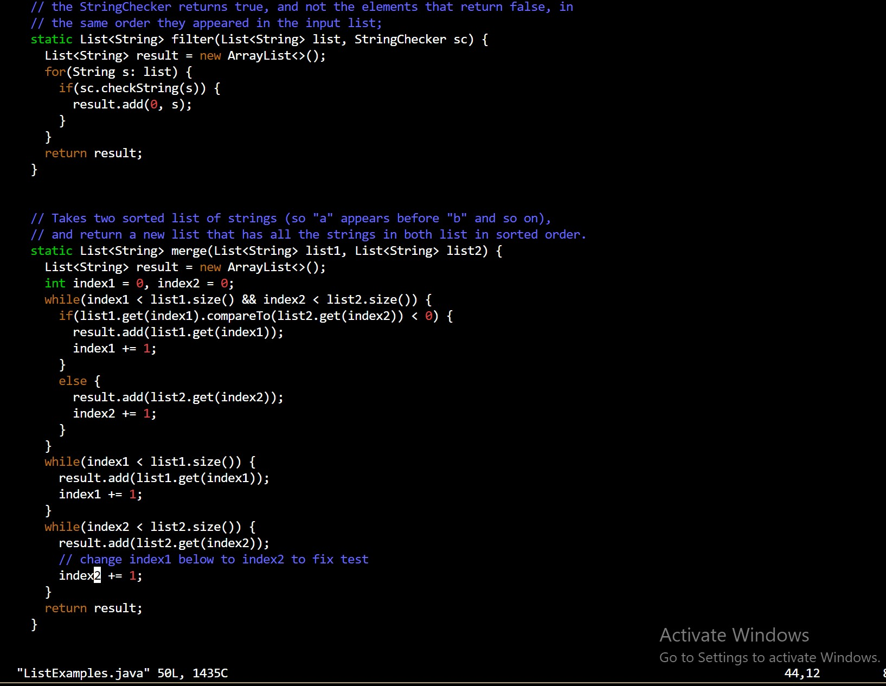
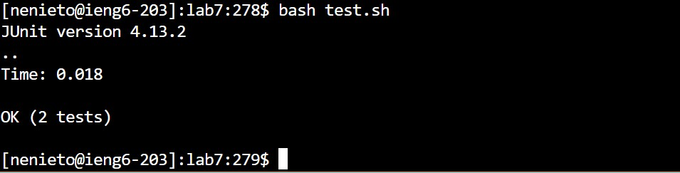
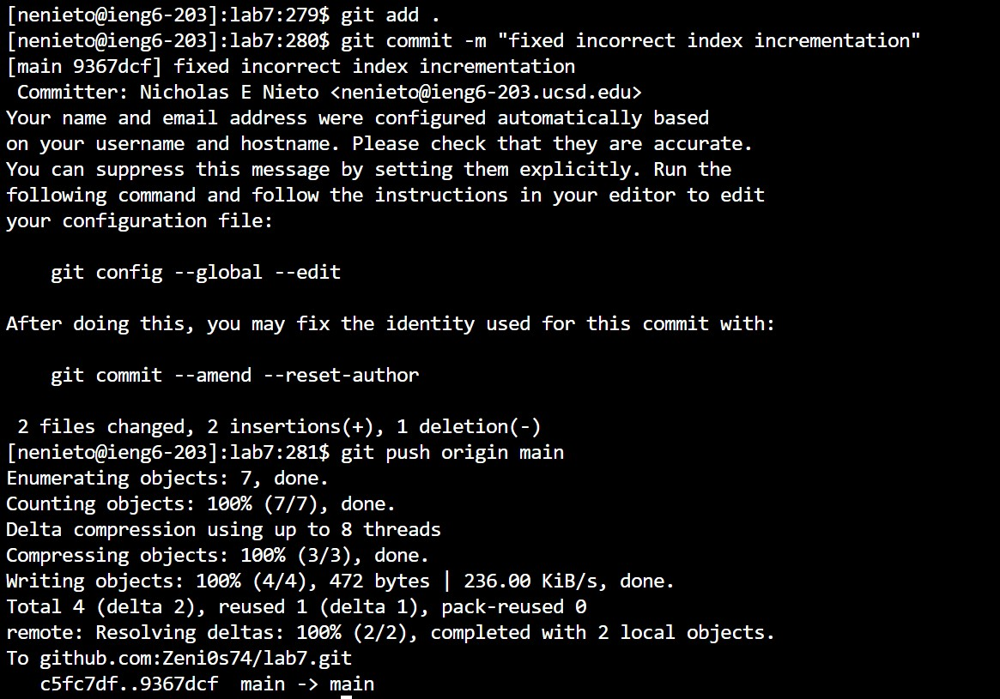

## Lab4 Report : VIM!
***
Today we'll have a bit of an easier lab to get through, we'll be reproducing the activity we did durring our in class lab on our own, step by step!

Now, first we'll want to use `ssh` to remotely access the `ieng6` server where we'll be doing all of our work, to do this for my user, I enter `ssh<space>nenieto@ieng6.ucsd.edu`

After we've confirmed we're logged in, we'll clone the fork of lab7 we made previously, that way it is available for us to modify here in the remote server! To clone our fork we'll use the `git<space>clone<space>git@github.com:Zeni0s74/lab7.git` command, using the ssh link for cloning is considered to be more secure since you'll need ssh access to the file to do so.

Just to be sure taht we're dealing with broken code, we `cd` into `lab7` and then use `bash test.sh` to run our tests and ensure they indeed don't work! From here, we can start using special characters to speed up our typing, the exact code being `cd<space>l<tab>` and `bash<space>t<tab>`!

Here is the real meat and potatoes, fixing our code! To access the `vim` editor for our java file, we'll use
`vim<space>ListExamples.java`
At this point, the `vim` edditor starts out cursor *exactly* where the error in the code is! So to fix it, all we need to do is hit `x` to delete the number 1 in index1, then `i` to enter edit-insert mode, followed by `2` to enter the correct index, then `esc` to leave edit mode and finally `:wq<enter>` to save out work and leave vim!
Total key string: `x` `i` `2` `esc` `:wq<enter>`

 
 

Since we've fixed our code, our test scrit should work now, and after entering the following into the terminal, we see that it does! `bash<space>t<tab>`

Finally, to save our cahnges and update our fork, we can use the following strings in terminal:
`git<space>add<space>.`
`git<space>com<tab><space>-m<space>"fixed<space>incorrect<space>index<space>incrementation"`
`git<space>pu<tab><space>or<tab><space>ma<tab>`

