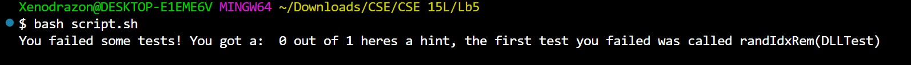
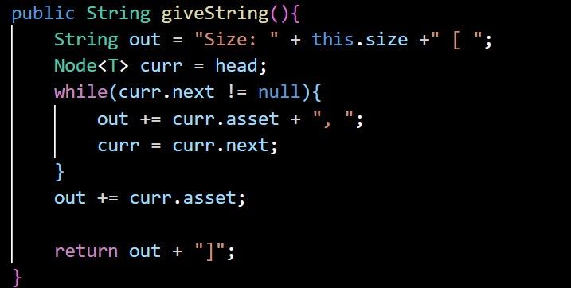
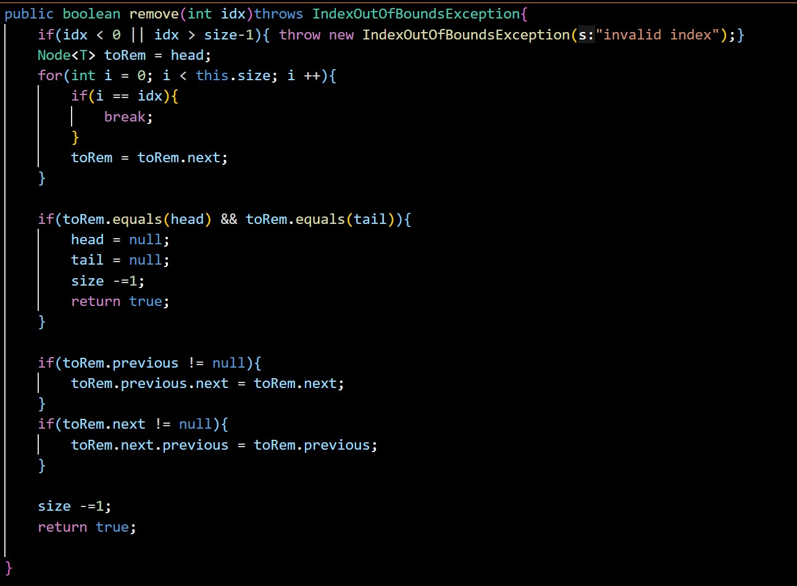

## Lab5 Report : putting it aaalll together!
***
For this lab Ill be writing a simple linked list to have our "student" and "TA" work through together!
***

`[Student]` : Hi! I was using the provided bash script to check my grade but i keep geting this failure

At first i though it was a printing issue since i made sure my remove worked in my tests but it still wont go through, heres my to string code:

`[TA]` : while the remove code can fail when teh string code is subpar, dont try to overthink things, usually the simplest solution is teh right one, try loking through your remove code again since the string code looks fine to me.

`[Student]` : 

I dont know how this could be going wrong though?? I made sure to check for ut of bounds indecies and fix our pointers in a one element list, and aside from that any other contained node should fix iteself

`[TA]` : I agree with *some* of what you just said, I cant outright point out the bug since that defeats the purpose of you learning how to debbug, but try going through the analofy section of what a linked list is in the PA instructions.

`[Student]` : 'instead of a traditional indexed list, a LinkedList acts more like a chain with an unknown number of links, where we place a post through the begining and ending links, using these posts as refrence points for any operation and pulling out and relocating these posts whenever we operate in a way that could try and change the number of links at either side"

I forgot to update the pointers if were removing the begining OR the end. dang it

`[TA]` : hah yea, try fixing that and then lets see the results.

