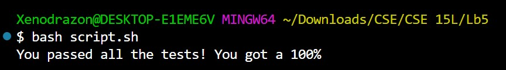

## Lab5 Report : putting it aaalll together!
***
For this lab Ill be writing a simple linked list to have our "student" and "TA" work through together!
***

`[Student]` : Hi! I was using the provided bash script to check my grade but i keep geting this failure

At first i though it was a printing issue since i made sure my remove worked in my tests but it still wont go through, heres my to string code:

`[TA]` : while the remove code can fail when teh string code is subpar, dont try to overthink things, usually the simplest solution is teh right one, try loking through your remove code again since the string code looks fine to me.

`[Student]` : 

I dont know how this could be going wrong though?? I made sure to check for out of bounds indecies and fix our pointers in a one element list, and aside from that any other contained node should fix iteself

`[TA]` : I agree with *some* of what you just said, I cant outright point out the bug since that defeats the purpose of you learning how to debbug, but try going through the analogy section of what a linked list is in the PA instructions.

`[Student]` : 'instead of a traditional indexed list, a LinkedList acts more like a chain with an unknown number of links, where we place a post through the begining and ending links, using these posts as refrence points for any operation and pulling out and relocating these posts whenever we operate in a way that could try and change the number of links at either side"

I forgot to update the pointers if were removing the begining OR the end. dang it

`[TA]` : hah yea, try fixing that and then lets see the results.

`[Student]` :

Ughh i highlighted the code that I added to my remove function and now its working, thank you. I was moving the head/tail pointers when I was removing the begining or end of a list longer than 1 entry, so when i iterated through the whole thing for print, the head ponter would still be pointing to the node I tried to remove, and because that node still pointed to another node, itd end up printing the whole list even if the node after it wasnt pointing back at ittt.

`[TA]` : yea that sounds about right, good job with your debugging!

***
as for step 4s requirements: 
- The file & directory structure needed
- The contents of each file before fixing the bug
- The full command line (or lines) you ran to trigger the bug
- A description of what to edit to fix the bug

The last 3 are basically included in the above pictures of the conversation, heres a picture of the file structure and a picture of the bash script I wrote, in this example its meant to be a hidden script the student cant see, but i still need to post something as proof that i wrote it hah,

***
## Reflection
***
Im still quite amaturish at coding, I can do well wnough when given instructions but starting from scratch off of just an idea is still a challenge! For example, writing the code for this lab was the longest part of it, Id assume an experienced coder would be able to shoot one out in a half hour or so, but writing the code and planting the bug took me about an hour or two.
Becuase of that, this class has taught me a lot in general, vim, jdb, bash, ALL of these were brand new to me when coming into the course, but they were all interesting and useful in their own respects. I feel as though with everything in coding, these tools that Ive learned will only serve to make the path ahead easier. JDB in particular was interesting to me since it lets you step through java cade step by step and inspect elements for any possible errors!

